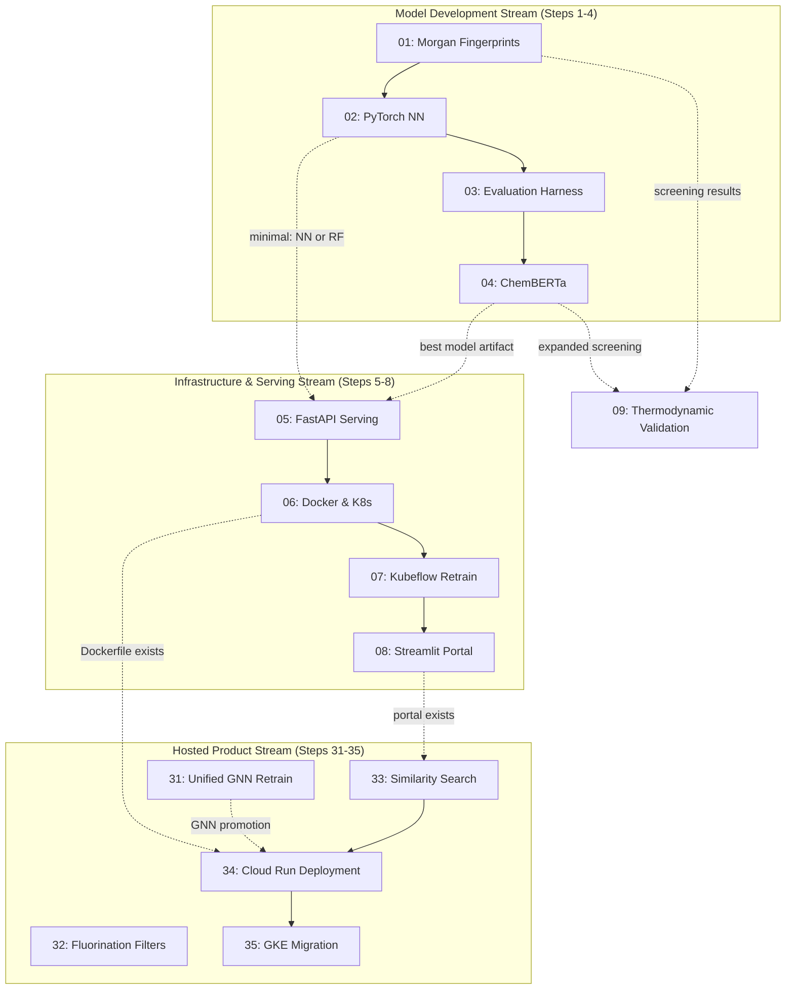

# Step Dependencies and Parallelization Guide

This document describes how the ML pipeline steps depend on each other and what can be parallelized. It is intended for agent orchestrators that need to automate the full pipeline in one run.

---

## Dependency Diagram (Mermaid)



---

## Dependency Graph (Machine-Readable YAML)

```yaml
steps:
  01_morgan_fingerprints:
    depends_on: []
    optional_deps: [dev]
    produces:
      - model/data/descriptors.py::build_features
      - model/data/descriptors.py::compute_morgan_fingerprints
      - model/gc_pcsaft.py (GC-PC-SAFT baseline)
      - RF baseline comparison table (including GC-PC-SAFT)
    gates: [02, 03, 04]

  02_pytorch_multitask_nn:
    depends_on: [01]
    optional_deps: [dev, nn]
    produces:
      - model/nn/ package
      - model/saved/nn_pcsaft.pt
      - model/saved/ad_model.joblib (applicability domain)
      - RF vs NN metrics (with uncertainty)
    gates: [03, 05]

  03_evaluation_harness:
    depends_on: [01, 02]
    optional_deps: [dev, nn]
    produces:
      - model/registry.py
      - model/evaluate.py (unified)
      - figures/03_evaluation_harness/ (parity, residual, calibration plots)
      - model/saved/comparison_metrics.csv
    gates: [04]

  04_chemberta_finetuning:
    depends_on: [01, 02, 03]
    optional_deps: [dev, nn, hf]
    produces:
      - model/hf/ package
      - model/saved/chemberta/ (fine-tuned model)
      - 4-way comparison table (GC-PC-SAFT vs RF vs NN vs ChemBERTa)
      - Expanded screening results (500+ candidates)
    gates: [05]

  05_fastapi_serving:
    depends_on: [01, 02, 03, 04]
    minimal_depends_on: [01, 02]
    optional_deps: [dev, nn, serve]
    produces:
      - serving/ package
      - /predict, /submit-data, /health endpoints
    gates: [06, 07, 08]

  06_docker_kubernetes:
    depends_on: [05]
    optional_deps: [dev, nn, serve]
    produces:
      - Dockerfile
      - k8s/ manifests
      - Deployed API pod
    gates: [07]

  07_kubeflow_retrain_pipeline:
    depends_on: [05, 06]
    optional_deps: [dev, nn, serve, pipeline]
    produces:
      - pipeline/ package
      - pipeline.yaml
      - Champion/challenger promotion flow
    gates: [08]

  08_streamlit_portal:
    depends_on: [05, 06, 07]
    minimal_depends_on: [05]
    optional_deps: [dev, serve, portal]
    produces:
      - portal/ package
      - Full end-to-end demo

  09_thermodynamic_validation:
    depends_on: [04]
    minimal_depends_on: [01]
    optional_deps: [dev, thermo]
    produces:
      - model/thermodynamic.py
      - model/saved/thermo_validation.csv
      - figures/09_thermodynamic_validation/
      - Parameter-vs-property rank correlation
    gates: []

  22_henrys_screening_counterfactual:
    depends_on: [20, 21]
    optional_deps: [dev, thermo]
    produces:
      - model/thermodynamic.py::compute_henrys_constant()
      - model/saved/henrys_constant_screening.csv
      - model/saved/vp_vs_henrys_comparison.csv
      - model/saved/henrys_polyol_sensitivity.csv
      - model/saved/standout_candidates_credibility.csv
    gates: [23]

  23_narrative_report_novel_predictions:
    depends_on: [22]
    optional_deps: [dev, thermo]
    produces:
      - model/saved/novel_pcsaft_predictions.csv
      - model/saved/active_learning_shortlist.csv (optional)
      - figures/23_ml_chemistry_narrative/ (5 figures)
      - docs/reports/23_ml_chemistry_narrative.md
    gates: [24]

  24_hfo_boiling_point_validation:
    depends_on: [09, 16]
    optional_deps: [dev, thermo]
    produces:
      - screening/hfo_screening.py
      - figures/24_hfo_boiling_point_validation/boiling_point_parity.png
      - docs/reports/24_hfo_boiling_point_validation.md
    gates: [25]

  25_hfo_centric_screening:
    depends_on: [24, 20]
    optional_deps: [dev, thermo]
    produces:
      - screening/results/hfo_centric_ranked.csv
      - figures/25_hfo_centric_screening/ (5 figures)
      - docs/reports/25_hfo_centric_screening.md
    gates: [27]

  26_extract_installable_package:
    depends_on: [02b, 14]
    optional_deps: [dev, nn]
    produces:
      - pcsaft_predict/ package
      - pcsaft_predict/pyproject.toml
      - tests/test_pcsaft_predict.py
    gates: [27, 29]

  27_generalize_portal:
    depends_on: [08, 25, 26]
    optional_deps: [dev, portal]
    produces:
      - portal/presets.py
      - portal/components/screener.py (new)
      - portal/app.py (modified)
      - portal/api_client.py (modified)
    gates: [29]

  28_dataset_model_card_publication:
    depends_on: [23, 25]
    optional_deps: [dev]
    produces:
      - data/pcsaft_novel_predictions_v1.csv
      - data/DATASHEET.md
      - docs/model_cards/gnn.md
      - docs/model_cards/rf.md
      - docs/model_cards/ensemble.md
      - CITATION.cff
    gates: [29]

  29_documentation_examples:
    depends_on: [26, 27, 28]
    optional_deps: [dev]
    produces:
      - README.md (rewritten)
      - examples/quickstart.ipynb
      - examples/screening_workflow.ipynb
      - CONTRIBUTING.md
      - docs/api/ (auto-generated)
    gates: [30]

  30_release_preparation:
    depends_on: [29]
    optional_deps: [dev]
    produces:
      - LICENSE
      - .github/workflows/ci.yml
      - .github/ISSUE_TEMPLATE/ (3 templates)
      - CHANGELOG.md
      - v1.0.0 git tag
    gates: []

  31_unified_gnn_retrain:
    depends_on: [02b, 14]
    optional_deps: [dev, nn]
    produces:
      - model/saved/gnn_pcsaft.pt (retrained on unified dataset)
      - model/saved/test_set.csv (shared train/test split)
      - docs/model_cards/gnn.md (updated)
      - docs/model_cards/ensemble.md (updated)
    gates: [34]

  32_fluorination_safety_filters:
    depends_on: [25]
    optional_deps: [dev]
    produces:
      - screening/filters.py (fluorine mass fraction, CF3, reactive site filters)
      - tests/test_fluorination_filters.py
    gates: []
    notes: Independent of Steps 31, 33, 34. Can run in parallel.

  33_similarity_search:
    depends_on: [05, 27]
    optional_deps: [dev, serve, portal]
    produces:
      - serving/app.py (POST /similar endpoint)
      - serving/schemas.py (SimilarityRequest, SimilarityResponse)
      - portal/components/predictor.py (similarity UI)
      - portal/api_client.py (find_similar method)
      - tests/test_similarity.py
    gates: [34]

  34_cloud_run_deployment:
    depends_on: [06, 33]
    soft_depends_on: [31]
    optional_deps: [dev, serve, portal]
    produces:
      - Dockerfile.portal
      - docker-compose.yaml
      - Cloud Run services (pcsaft-api, pcsaft-portal)
    gates: [35]
    notes: >
      Deploys to GCP Cloud Run (project: project-fd592eb9-74e2-455d-959).
      Custom domain (mlchem.andylitalo.com) mapping deferred.
      Soft dependency on Step 31: can deploy with RF if GNN promotion
      criteria not yet met.

  35_gke_migration:
    depends_on: [34]
    optional_deps: [dev, serve, portal]
    produces:
      - k8s/portal-deployment.yaml
      - k8s/portal-service.yaml
      - k8s/ingress.yaml
      - k8s/api-hpa.yaml
    gates: []
    notes: >
      Future extension. Migrate from Cloud Run to GKE only if needed
      (cold-start latency, PVCs, GPU, service mesh). May never be
      executed for the current project scope.

  # Future work (not in numbered sequence):
  # - Association parameter scoping: docs/steps/future/association_parameter_scoping.md
  #   Go/no-go memo on 5-parameter (ε_AB, κ_AB) prediction.
  #   No dependency on numbered steps. Deferred until hosted product is stable.
```

---

## Parallelization Policy

The model stream (01-04) runs sequentially. The infra stream (05-08) also runs sequentially. The two streams can partially overlap:

- **After Step 02 is approved**, Step 05 can begin with a stub model loader using RF or NN artifacts.
- **After Step 05 is complete**, Steps 06-08 proceed sequentially.
- Step 08 can start its predict/submit UI as soon as Step 05 exists (dashboard tab requires Step 07).

**Hosted product stream (31-35)**:
- Steps 31 (GNN retrain), 32 (fluorination filters), and 35's prerequisite research can run in parallel.
- Step 33 (similarity search) should complete before Step 34 (Cloud Run deployment).
- Step 31 is a soft dependency for Step 34: deploy with RF if GNN promotion is not yet decided.
- Step 35 (GKE migration) is a future extension that may never be needed.
- Association parameter scoping (`docs/steps/future/`) has no dependencies on numbered steps.

File ownership rules in `PLAN.md` prevent conflicts. Never have two agents modify the same file.

---

## Environment Setup (uv)

This project uses **uv** for dependency management and virtual environments. Each step can use a different set of extras. `uv sync` handles venv creation and lockfile resolution automatically.

| Step(s) | Install | Notes |
|---------|---------|-------|
| 01, 03 | `uv sync --extra dev` | RDKit, scikit-learn, pandas |
| 02 | `uv sync --extra dev --extra nn` | Adds PyTorch |
| 04 | `uv sync --extra dev --extra nn --extra hf` | Adds transformers, datasets |
| 05, 06 | `uv sync --extra dev --extra nn --extra serve` | Adds FastAPI, uvicorn |
| 07 | `uv sync --extra dev --extra nn --extra serve --extra pipeline` | Adds kfp |
| 08 | `uv sync --extra dev --extra portal` | Adds streamlit |
| 09 | `uv sync --extra dev --extra thermo` | Adds teqp (CPU-only EOS solver) |

Alternatively, install everything: `uv sync --all-extras`.

---

## Result Gates

Run `python scripts/check_gate.py <step>` to verify programmatically.

| Step | Cannot Start Until |
|------|---------------------|
| 02 | `build_features()` exists in `model/data/descriptors.py` |
| 03 | `model/saved/nn_pcsaft.pt` exists |
| 04 | `model/registry.py` exists with RF and NN registered |
| 05 | At least one trained model artifact exists |
| 06 | `serving/app.py` and `serving/model_loader.py` exist |
| 07 | `k8s/` manifests exist |
| 08 | `serving/app.py` and `pipeline/pipeline.py` exist |
| 09 | Screening results CSV exists in `screening/results/` |
| 34 | `Dockerfile.portal` exists; `docker-compose.yaml` exists; `/similar` endpoint exists in `serving/app.py` |
| 35 | Cloud Run services deployed and reachable (Step 34 complete) |
