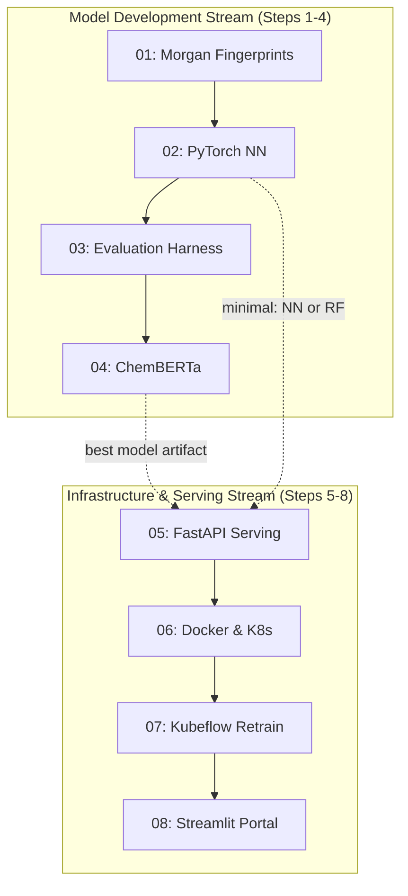

# Step Dependencies and Parallelization Guide

This document describes how the eight ML pipeline steps depend on each other and what can be parallelized. It is intended for agent orchestrators that need to automate the full pipeline in one run.

---

## Dependency Diagram (Mermaid)



---

## Dependency Graph (Machine-Readable YAML)

```yaml
steps:
  01_morgan_fingerprints:
    depends_on: []
    optional_deps: [dev]
    produces:
      - model/data/descriptors.py::build_features
      - model/data/descriptors.py::compute_morgan_fingerprints
      - model/gc_pcsaft.py (GC-PC-SAFT baseline)
      - RF baseline comparison table (including GC-PC-SAFT)
    gates: [02, 03, 04]

  02_pytorch_multitask_nn:
    depends_on: [01]
    optional_deps: [dev, nn]
    produces:
      - model/nn/ package
      - model/saved/nn_pcsaft.pt
      - model/saved/ad_model.joblib (applicability domain)
      - RF vs NN metrics (with uncertainty)
    gates: [03, 05]

  03_evaluation_harness:
    depends_on: [01, 02]
    optional_deps: [dev, nn]
    produces:
      - model/registry.py
      - model/evaluate.py (unified)
      - figures/03_evaluation_harness/ (parity, residual, calibration plots)
      - model/saved/comparison_metrics.csv
    gates: [04]

  04_chemberta_finetuning:
    depends_on: [01, 02, 03]
    optional_deps: [dev, nn, hf]
    produces:
      - model/hf/ package
      - model/saved/chemberta/ (fine-tuned model)
      - 4-way comparison table (GC-PC-SAFT vs RF vs NN vs ChemBERTa)
      - Expanded screening results (500+ candidates)
    gates: [05]

  05_fastapi_serving:
    depends_on: [01, 02, 03, 04]
    minimal_depends_on: [01, 02]
    optional_deps: [dev, nn, serve]
    produces:
      - serving/ package
      - /predict, /submit-data, /health endpoints
    gates: [06, 07, 08]

  06_docker_kubernetes:
    depends_on: [05]
    optional_deps: [dev, nn, serve]
    produces:
      - Dockerfile
      - k8s/ manifests
      - Deployed API pod
    gates: [07]

  07_kubeflow_retrain_pipeline:
    depends_on: [05, 06]
    optional_deps: [dev, nn, serve, pipeline]
    produces:
      - pipeline/ package
      - pipeline.yaml
      - Champion/challenger promotion flow
    gates: [08]

  08_streamlit_portal:
    depends_on: [05, 06, 07]
    minimal_depends_on: [05]
    optional_deps: [dev, serve, portal]
    produces:
      - portal/ package
      - Full end-to-end demo
```

---

## Parallelization Policy

The model stream (01-04) runs sequentially. The infra stream (05-08) also runs sequentially. The two streams can partially overlap:

- **After Step 02 is approved**, Step 05 can begin with a stub model loader using RF or NN artifacts.
- **After Step 05 is complete**, Steps 06-08 proceed sequentially.
- Step 08 can start its predict/submit UI as soon as Step 05 exists (dashboard tab requires Step 07).

File ownership rules in `PLAN.md` prevent conflicts. Never have two agents modify the same file.

---

## Environment Setup (uv)

This project uses **uv** for dependency management and virtual environments. Each step can use a different set of extras. `uv sync` handles venv creation and lockfile resolution automatically.

| Step(s) | Install | Notes |
|---------|---------|-------|
| 01, 03 | `uv sync --extra dev` | RDKit, scikit-learn, pandas |
| 02 | `uv sync --extra dev --extra nn` | Adds PyTorch |
| 04 | `uv sync --extra dev --extra nn --extra hf` | Adds transformers, datasets |
| 05, 06 | `uv sync --extra dev --extra nn --extra serve` | Adds FastAPI, uvicorn |
| 07 | `uv sync --extra dev --extra nn --extra serve --extra pipeline` | Adds kfp |
| 08 | `uv sync --extra dev --extra portal` | Adds streamlit |

Alternatively, install everything: `uv sync --all-extras`.

---

## Result Gates

Run `python scripts/check_gate.py <step>` to verify programmatically.

| Step | Cannot Start Until |
|------|---------------------|
| 02 | `build_features()` exists in `model/data/descriptors.py` |
| 03 | `model/saved/nn_pcsaft.pt` exists |
| 04 | `model/registry.py` exists with RF and NN registered |
| 05 | At least one trained model artifact exists |
| 06 | `serving/app.py` and `serving/model_loader.py` exist |
| 07 | `k8s/` manifests exist |
| 08 | `serving/app.py` and `pipeline/pipeline.py` exist |
